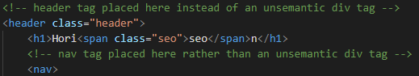

# site-refactor
Horiseon's site is refactored to follow accessibility standards and has been optimized for search engines.

## Who is Horiseon For?

Horiseon's website is a great place for people who are curious to learn more about Search Engine Optimization, Online Reputation Management, Social Media Marketing, Lead Generation and more.

## Accessibility Features
This website features key items for an accessible webpage like Semantic HTML elements, alternative text for icons and images and logical structuring separate from visual elements like styling and positioning.

### Semantic HTML Elements

The site contains HTML elements such as &lt;nav&gt;, &lt;header&gt;, &lt;footer&gt;, &lt;section&gt;, &lt;article&gt;, and &lt;aside&gt; to differentiate the content on the page clearly to all users. An example can be seen below as to how it looks within the HTML file:



### Alternative Text for Images and Icons

Each image and icon on the Horiseon site contains alternative text for screen readers and in the case that the images cannot be loaded. The snippet of code below shows 3 examples of how this is represented in the HTML:

```


```

## Usage

The best way to use this site is by just visiting the page yourself here on github by clicking on the link below:

[Horiseon](https://coderbennett.github.io/site-refactor/)


## Licensing

Horiseon is available under the MIT license. For licensing details see [LICENSE](LICENSE.txt) document

